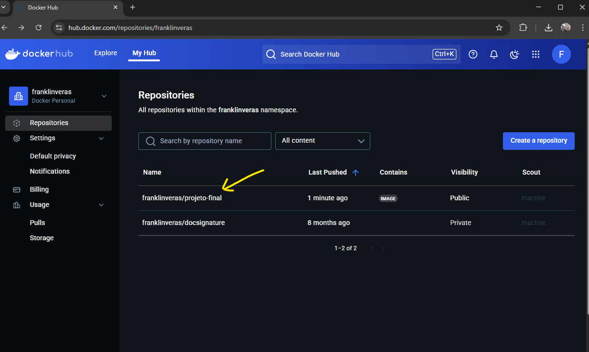
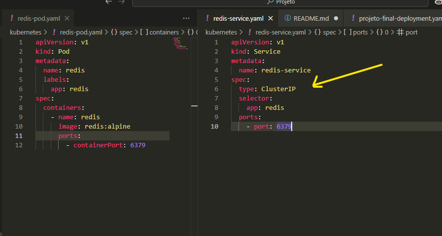
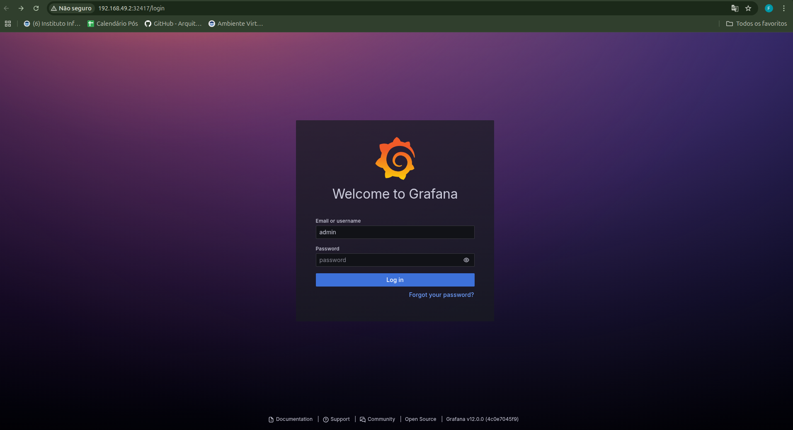

# Projeto final da matéria de Integração Contínua, DevOps e Computação em Nuvem [25E1_3]

## Sumário
- [Descrição do Projeto](#descrição-do-projeto)
- [Estrutura do Projeto](#estrutura-do-projeto)
- [Detalhamento Técnico](#detalhamento-técnico)
- [Execução do Projeto](#execução-do-projeto)
- [Como obter o IP e a porta do serviço](#como-obter-o-ip-e-a-porta-do-serviço-projeto-final-para-stress-test)
- [Checklist dos Critérios Atendidos](#checklist-dos-critérios-atendidos)
- [Boas Práticas de Segurança](#boas-práticas-de-segurança)
- [Considerações Finais](#considerações-finais)

## Descrição do Projeto
O **File Service** é um serviço para upload de imagens e conversão de HTML para PDF usando Puppeteer. O projeto foi containerizado, orquestrado com Kubernetes, monitorado com Prometheus/Grafana e testado com K6.
## Estrutura do Projeto
```
/projeto
	├── assets/          # recursos para a geração do readme.
	├── file-service/    # código fonte do serviço.
	├── k6/              # scripts de stress test.
	└── kubernetes/      # Configuração do Kubernetes para orquestração de containers.
```

## Desafios e decisões
### Docker
- A criação da imagem Docker foi tranquila, pois eu já tinha experiência com Docker. A única dificuldade foi a configuração do Puppeteer, que exigiu a instalação de algumas dependências adicionais e é bem sensível a problemas com permissões.,

### Minikube
- Muito prático para desenvolvimento local, facilita muito as provas de conceito.

### Prometheus e Grafana
- A configuração do grafana foi bem simples, mas o scraping do prometheus foi um pouco mais complicado. O prometheus não estava coletando as métricas corretamente, o que exigiu ajustes na configuração do serviço e no deployment. e por parte do meu projeto tive que acrescentar o prom-client para expor as métricas do serviço. Acredito que foi a parte mais difícil do projeto.

### K6
- O k6 é realmente fantástico para realizar testes de carga. A configuração do script foi simples e a execução foi rápida.

### Github actions em vez de jenkins
- Apesar do jenkins ser mais robusto, o uso de github actions simplifica o processo de CI/CD, especialmente para projetos menores. No começo do projeto, o jenkins foi utilizado, mas devido a dificuldades de configuração e integração com o minikube, optou-se por github actions. <br/><br> Eu realmente estressei ao máximo a possibilidade de utilizar o jenkins, mas não consegui fazer funcionar. O github actions foi uma solução mais simples e rápida, optei por uma abordagem mais prática e instalei o runner auto-gerenciado, o que achei incrível para projetos pequenos e médios. Facilitou muito a configuração do pipeline.

### Segurança
- A configuração de segurança foi feita com o uso de secrets para o github e RBAC para a comunicação do prometheus com o cAdvisor. Achei a documentação do kubernetes um pouco confusa neste ponto, mas consegui entender como funciona.

## Detalhamento Técnico

### Containerização e Docker
- Imagem Docker customizada para o serviço.
- Dockerfile otimizado para reduzir o tamanho da imagem.
- Publicação da imagem no Docker Hub.

### Kubernetes
- Deployments com múltiplas réplicas para alta disponibilidade.
- Services do tipo NodePort e ClusterIP.
- Volumes e PVCs para persistência.
- Probes configurados:
  - Readiness Probe: garante que o serviço só recebe tráfego quando está pronto.
  - Liveness Probe: reinicia o pod em caso de falha.

### Pipeline CI/CD
- O pipeline é implementado com GitHub Actions, utilizando um runner auto-gerenciado.
- Automatiza o build, push da imagem Docker e o deploy no cluster Kubernetes.
- Controle de acesso ao pipeline via permissões do GitHub e autenticação do runner.

### Stress Test
- Script K6 simula múltiplos usuários e gera carga para análise de performance.
- Resultados do teste são coletados e exibidos no Grafana.

### Monitoramento
- Prometheus coleta métricas dos pods e serviços.
- Grafana exibe dashboards customizados (CPU, memória, latência, erros).

### Segurança
- Uso de Secrets para variáveis sensíveis.
- RBAC para limitar permissões dos serviços.
- Controle de acesso ao Grafana e Jenkins.
- Recomenda-se criptografia de dados sensíveis.

## Execução do Projeto

1. Clone o repositório:
	```bash
	git clone https://github.com/franklinveras/projeto-final-infnet-k8s.git
	cd projeto-final-infnet-k8s
	```
2. Aplique as configurações do Kubernetes:
	```bash
	kubectl apply -f kubernetes/
	```
3. Altere o url do serviço `projeto-final` e Execute o arquivo k6/app.js para realizar o stress test:
	```bash
	cd k6 && k6 run app.js
	```
4. Acesse o Grafana para visualizar as métricas:
	```bash
	minikube service grafana
	```

## Como obter o IP e a porta do serviço `projeto-final` para stress test

Para executar o stress test com o K6, é necessário saber o endereço (IP e porta) pelo qual o serviço `projeto-final` está exposto no cluster Kubernetes. Siga os passos abaixo:

1. Liste os serviços do cluster para encontrar o NodePort do serviço `projeto-final`:

```bash
kubectl get svc
```

Procure pela linha referente ao `projeto-final-service` (ou nome similar). O valor da coluna `NODE-PORT` será a porta exposta.

2. Descubra o IP do seu Minikube (ou do nó do cluster):

Se estiver usando Minikube, execute:
```bash
minikube ip
```

O resultado será o IP a ser utilizado.


## Checklist dos Critérios Atendidos

<ol>
	<li>Utilização do Docker para criar uma imagem personalizada da aplicação.<br/>
		
		<ol style="list-style-type: lower-alpha;">
			<li>Publicação da imagem no Docker Hub.<br/>
				
			</li>
		</ol>
	</li>
	<li>Deploy da imagem em um cluster Kubernetes:
		<ol style="list-style-type: lower-alpha;">
			<li>Deployment com 4 réplicas.<br/>
				
			</li>
			<li>Exposição da aplicação via NodePort ou LoadBalancer<br/>
				
			</li>
			<li>Banco de dados ou Redis acessível via ClusterIP.<br/>
				
			</li>
			<li>Configuração de probe (Readiness ou Liveness).<br/>
				
			</li>
		</ol>
	</li>
	<li>Monitoramento da aplicação com Prometheus e Grafana:
		<ol style="list-style-type: lower-alpha;">
			<li>Grafana<br/>
			<br/>
			
			</li>
			<li>Prometheus
			<br>
			</li>
			<li>Dashboards do Grafana exibindo métricas
			
			</li>
		</ol>
	</li>
	<li>Pipeline de entrega contínua implementado com Github Actions
		
		
	</li>
	<li>Execução de stress test com o k6, monitorado pelo Grafana:
	
	
	</li>

</ol>

## Boas Práticas de Segurança
- Uso de Secrets para variáveis sensíveis.
- RBAC para limitar permissões dos serviços.
- Controle de acesso ao Grafana

## Considerações Finais
O projeto demonstra a integração de práticas DevOps, automação, monitoramento e segurança em um ambiente Kubernetes.
